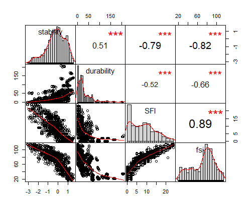
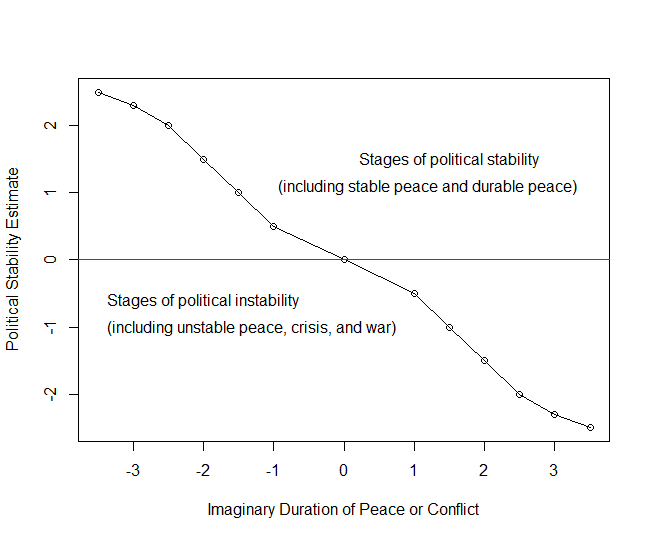

```{r setup, include=FALSE}
knitr::opts_chunk$set(echo = TRUE)
```
In the aftermath of World War II, as new states rose in Asia and Africa from the dying European colonial empires, the key concept used by most political scientists and policy makers around the world for explaining the situation of these news states and guiding them through the political, economic, and social development was "modernization." Summarizing the assumptions of "modernization theory," Francis Fukuyama states that:   

> Modernization theorists placed a strong normative value on being modern, and in their view, the good things of modernity tended to go togther. Economic development, changing social relationships like urbanization and the breakdown of primary kinship groups, higher and more inclusive levels of education, normative shifts towards values like 'achievement' and rationality, secularization, and the development of democratic political institutions were all seen as an interdependent whole. [Francis Fukuyama, foreword to @huntingtonPoliticalOrderChanging1968, p. xii]

However, just a few decades later, Samuel Huntington challenged these assumptions by asserting, among other things, that "political decay was at least as likely as political development, and that the actual experience of newly independent countries was one of increasing social and political disorder" [@huntingtonPoliticalOrderChanging1968, p. xii]; and furthermore, by drawing a conclusion from his observations that:   

> Political order was a good thing in itself and would not automatically arise out of the modernization process. Rather the contrary: without political order, neither economic nor social development could proceed successfully. [@huntingtonPoliticalOrderChanging1968, p. xiii]

Ultimately, as Fukuyama puts it, Huntington's concept of *political order* "killed off modernization theory" when, in addition to his attacks on its assumptions, the "critique from the Left" argued that:   

> Modernization theorists enshrined an ethnocentric European or North American model of social development as a universal one for humanity to follow. American social science found itself suddenly without an overaching theory, and began its subsequent slide into its current methodological Balkanization. [@huntingtonPoliticalOrderChanging1968, pp. xiii-xiv]   


Since the end of the Cold War, however, as the number of armed conflicts within and between the new states dramatically increased and many of them were barely able to survive, a new generation of political scientists and policy makers came up with other new concepts to explain their situation and guide them through the process of political, economic, and social development. First, there was the concept of "political stability" (or its opposite, "political instability"),^[We will use the term "political stability/instability" throughout this study, when the terms "political stability" and its opposite, "political instability," can be used interchangeably.] which was already used by Huntington with that of "political order," although it was not his main focus. [-@huntingtonPoliticalOrderChanging1968, pp. 78-92]. Then, since the 1990s, other concepts, such as "rogue state," "failed state," "state failure," "weak state," and "fragile state," were also used simulatneously with that of "political stability/instability." Nevertheless, it appears that the latter concept was the most frequently used to describe the political situation of the news states (and any other states in the world for that matter), whether they were successful or failing, strong or fragile. In fact, as Susan Woodward reports, even "the *State Failure Task Force* funded by the CIA had changed its title to the *Political Instability Task Force* in 2003, and the National Intelligence Council (the policy think tank for the CIA) decided in 2005 to establish a semi-annual *Political Instability Watch List*." [@woodwardIdeologyFailedStates2017, p. 48, our emphasis.] Meanwhile, even though the Center for Systemic Peace and the Fund for Peace each have their own "fragility index,"^["State Fragility Index (SFI)" for the Center for Systemic Peace, and "Fragile State Index (FSI)" for the Fund for Peace] in replacement of the flawed "Failed State Index" [@woodwardIdeologyFailedStates2017, p. 22], these new indices and their related databases [@centerforsystemicpeaceINSCRDataPage2018; @marshallGlobalReport20172017; @thefundforpeaceFragileStatesIndex2017] were not as commonly used and practical as those of Daniel Kaufman and his associates'indicators and database, which were adopted and housed by the World Bank under the umbrella of *World Governance Indicators* [See @worldbankWorldwideGovernanceIndicators2016; and @kaufmannWorldwideGovernanceIndicators2011]. Given the fact that the concept of political stability/instability was more commonly used and practical than the other concepts to describe the political situation of the new states, and given the sheer number of studies that have been already undertaken by various scholars on this issue,^[A Google Scholar search on the keyword *political stability* would for instance yield about 3,430,000 results, and a search on the keyword *state fragility* only 365,000.] this study will also focus on the issue of political stability/instability in Africa.   


As discussed below, the concept of political stability/instability can be defined and measured in many different ways. Nevertheless, no matter how it is defined and measured, most scholars are now generally accepting that political stability/instability has tremendous impacts on the economic and social development of any state in the world. [@aisenHowDoesPolitical2011; @alesinaPoliticalInstabilityEconomic1996; and @roePoliticalInstabilityEffects2011] Due to its significant impacts, anyone involved in any aspect of development in Africa is looking for political stability for the continent. For instance, the African Union points out in its Constitutive Charter "the fact that the scourge of conflicts in Africa constitutes a major impediment to the socio-economic development of the continent and of the need to promote peace, security and stability as a prerequisite for the implementation of our development and integration agenda" [@africanunionConstitutiveActAfrican2000, Preamble]. Consequently, one of the main objectives of the African Union is "to promote peace, security, and stability on the continent" [@africanunionConstitutiveActAfrican2000, Article 3.f]. For the international donors, political stability in Africa has been a major concern since the end of the Cold War. Particularly, the World Bank and the International Monetary Fund (IMF) have undertaken and supported countless research projects and publications on this issue. Among many others, the major research projects sponsored by the World Bank include those undertaken by Paul Collier and his associates on "Understanding Civil War" [@collierUnderstandingCivilWar2005] and "Breaking the Conflict Trap: Civil War and Development Policy" [@collierBreakingConflictTrap2003]. More specifically, the *World Development Report* for the year 2011 was devoted to "Conflict, Security, and Development." [@worldbankWorldDevelopmentReport2011a] Nevertheless, despite all of these efforts undertaken by different actors, as we will see in this book, Africa is still the most unstable region of the world, and the quest for political stability appears to be elusive for many African countries.   


## What is Political Stability? An Elusive Definition and Measurement

The definition and measurement of the concept of political stability/instability remain controversial, if not elusive, despite the efforts deployed by different scholars and international organizations over the years to come up with a consensual definition and measurement. This situation led some authors to believe that "stability cannot be quantified and that there are thus no degrees of stability" [@dowdingMeaningUsePolitical1983]. In fact, the definition and measurement of this concept have evolved over the years.   

In the 1970s, an early formal definition proposed by Claude Ake states that "political stability is the regularity of the flow of political exchanges" [@akeDefinitionPoliticalStability1975, p. 273]. Unfortunately, no one (including the author himself) could build a cross-national and longitudinal database on political stability based on this definition. Since then, several scholars simply identify political stability with lack of conflict or the ability of a political system to "prevent conflict" and survive. [@reynal-querolPoliticalSystemsStability2002, p. 465] In this sense, many of them use the occurence of conflict and/or the durability of political system as the main indicators of political stability or instability [@goldstoneGlobalModelForecasting2010]. In addition, a fairly common measurement of political stability/instability is the frequency of cabinet change and regime change (or regime duration). The long list of authors who use this type of measurement includes Alesina et al. [-@alesinaPoliticalInstabilityEconomic1996] in their investigation of the impacts of political instability economic growth, Hegre et al. [-@hegreDemocraticCivilPeace2001] in their study on the association between regime type and national security, and Gates et al. [-@gatesInstitutionalInconsistencyPolitical2006a] in their examination of "how political institutional structures affect political instability." Moreover, a closer look at the concept of political instability "using 25 political instability indicators in an Exploratory Factor Analysis," allow Richard Jong-A-Pin to suggest four dimensions of political instability:  "(1) politically motivated violence, (2) mass civil protest, (3) instability within the political regime, and (4) instability of the political regime." [@jong-a-pinMeasurementPoliticalInstability2009, p. 16]   

In recent years, the World Bank and different authors adopt the definition and measurement of "Political Stability and Absence of Violence/Terrorism (PV)" proposed by Kaufmann, Kraay, and Mastruzzi, as part of their work on the *World Governance Indicators* (WGI). [@worldbankWorldwideGovernanceIndicators2016; and @kaufmannWorldwideGovernanceIndicators2011] "Political Stability and Absence of Violence/Terrorism (PV)" or simply "political stability" is here defined as "the likelihood that the government will [or will not] be destabilized or overthrown by unconstitutional or violent means, including politically-motivated violence and terrorism." It is considered as one of the "six dimensions of governance," which include: "Voice and Accountability, Political Stability and Absence of Violence/Terrorism, Government Effectiveness, Regulatory Quality, Rule of Law, and Control of Corruption." [@kaufmannWorldwideGovernanceIndicators2011, p. 4] More importantly, Kaufman et al.'s innovation in this research project is to "rely exclusively on perceptions-based governance data sources." [@kaufmannWorldwideGovernanceIndicators2011, p. 5] As they explain, "Our data sources include surveys of firms and households, as well as the subjective assessments of a variety of commercial business information providers, non-governmental organizations, and a number of multilateral organizations and other public-sector bodies." [@kaufmannWorldwideGovernanceIndicators2011, p. 5]   


We decide to adopt Kaufmann and his associates' definition and measurement of political stability in this study for two reasons. First, since the concept of political stability is highly subjective, it would make more sense to use a measurement technique based on intersubjective scale, like the "Lickert Scale," that is commonly used as a valid measurement technique in various social science disciplines.[@joshiLikertScaleExplored2015; see also @hollwayDoingQualitativeResearch2000; @charmazConstructingGroundedTheory2006] Second, based on their definition and measurement, Kaufmann and his associates are able to build and maintain a consistent database on political stability for most countries in the world since 1996. This database is easily accessible through the World Bank's databank website. [@worldbankWorldwideGovernanceIndicators2016] It is also worth noting that when we compare Kaufman and his associates' political stability score estimates with the Center of Systemic Peace's durability variable (which is included in Polity IV dataset) and State Fragility Index (SFI), as well as the Fund for Peace's Fragile State Index (FSI), we find that these four variables are correlated with high statistical significance (or p-value).^[See Fig. 1.1 - Correlations between Stability, Durabilty, State Fragility Index (SFI), and Fragile State Index (FSI)] While political stability estimate is weakly correlated with regime durability (with the correlation coefficient of 0.51), it is nonetheless strongly correlated with SFI and FSI (with respectively a correlation coefficient of -0.79 and -0.82). This means that political stability estimate, which is based on intersubjective measurement, somehow captures some realities as the SFI and FSI, which are based on the objective measurements of different variables.^[For more information on the Center of Systemic Peace's State Fragility Index (SFI), see @marshallGlobalReport20172017; and for more information on the Fund for Peace's Fragile State Index (FSI), see @thefundforpeaceFragileStatesIndex2017a]


## Why Does Political Stability Matter?


With a very few exceptions, every study on the relationship between political stability and economic performance finds a positive effect of the former on the latter. In other words, lack of political stability (or political instability, with its different forms and degrees, including political crisis and armed conflicts) is associated with poor economic and social development. The only exceptions we find in the literature so far are that of Campos and Nugent who assert that there is no evidence of a "causal and negative long-run relation between political instability and economic growth." [@camposWhoAfraidPolitical2002, p. 157]


Also, most of the early studies reveal the negative consequence of political instability on economic growth. According to Alesina et al.'s classical study, "political instability defined as a propensity for government change had a negative impact on growth." [@alesinaPoliticalInstabilityEconomic1996] In the same vein, Aisen and Veiga also find "higher degrees of political instability are associated with lower growth rates of GDP per capita." [@aisenHowDoesPolitical2011, p. 1] In addition, they specify that "political instability adversely affects growth by lowering the rates of productivity growth and, to a smaller degree, physical and human capital accumulation." [@aisenHowDoesPolitical2011, p. 1]   

More recent studies expand the negative impacts of political instability on other economic and social indicators, such as foreign direct investment (FDI) [See, for instance, @bradaEffectsTransitionPolitical2006; @phungImpactInstitutionalPolitical2017; and @gedaDeterminantsForeignDirect2018], inflation [@aisenDoesPoliticalInstability2006], food security [@deatonPoliticalInstabilityFood2015], social inequality and poverty [@roePoliticalInstabilityEffects2011]. Everyone who investigates the relationships between political stability and inflows of FDI agrees with Brada et al. that while political stability "increase the volume of FDI inflows," political instability reduce their inflows [@bradaEffectsTransitionPolitical2006, p. 649]. Furthermore, Aisen and Veiga find that "a higher degree of political instability is associated with higher inflation," which in turn "generates inefficiencies that reduce society's welfare and economic growth." [@aisenDoesPoliticalInstability2006, p. 1379]


Moreover, other recent studies also show the important role of political stability as an enabling factor that helps other economic factors to be more efficient. In connection with this, investigating the effects of foreign development assistance on African economies, Cai et al. find that "international aid can promote economic growth in Africa, but the effectiveness of aid depends on countries’ political stability." [@caiHasInternationalAid2018, p. 239]   


In sum, political stability is crucial for the economic and social development of any country in the world. Its absence is generally associated with a poor economic and social development in different countries.  As we will see in the next chapter, Africa remains the most unstable region in the world since the end of the Cold War. In line with this, the main purpose of this study is to address the question of why is this the case and why the quest for political stability seems to be elusive for many African countries.


## Approach to Political Stability and Research Methodology


Many scholars are now acknowledging that most of the studies that have been conducted so far on conflicts and more specifically on civil wars incorporate some serious flaws. Indeed, in the early 2000s, Nicholas Sambanis points out the fact that most of these studies, which are based on quantitative research methods, “use macro-level data to test hypotheses about civil war that are based on ideas about micro-level behavior (e.g., why individuals would join an insurgency)” (Sambanis, 2004, 259). To address this serious flaw, the author suggests using qualitative case studies, so that the causes of conflicts can be studied at different levels (individual, state, and international levels). In relation to this problem of levels of analysis, quantitative research methods are by design inappropriate for addressing questions such as “who did what, when, to what effect.” In other words, an inquiry into the actors and their behaviors which are obviously the primary causes of conflicts is usually missing from most of the existing studies based on quantitative research methods. Finally, just recently, Michael Ward and his associates [-@wardPerilsPolicyPvalue2010a], followed by Håvard Hegre and his [-@hegreViEWSPoliticalViolence2019a] warn us against the limitations of traditional correlation and regression analyses that are based on statistical significance (or p-value). In effect, in conducting "a side-by-side comparison of the statistical significance and predictive power of the different variables used in two of the most influential models of civil war," Michael Ward and his associates are able to demonstrate "how potentially misleading the traditional focus on statistical significance can be." [@wardPerilsPolicyPvalue2010a, p. 364]


We will try to avoid these mistakes in this study by adopting a "conflict approach" that takes in consideration the “curve of conflict” or “life story of conflict," and by combining quantitative and qualitative research methods. First, in connection with the "conflict approach," instead of focusing exclusively on the conditions (i.e., determinants or factors) of political instability as in most quantitative studies or exclusively on the triggering events (i.e., the actors and their behaviors that would cause the political instability) as in some qualitative studies, we take into consideration both conditions and triggers at the same time, and assume that conflicts only emerge and escalate because of the existence of powerful triggering events and under favorable conditions. This approach was inspired by the seminal work of Michael Lund, *Preventing Violent Conflicts:  A Strategy for Preventive Diplomacy* [-@lundPreventingViolentConflicts1996], which was the first to introduce the concept of “curve of conflict” or “life story of conflict.” Michael Lund’s work was later expanded by Matthew Levinger [-@levingerConflictAnalysisUnderstanding2013] and became one of the core elements of the United States Institute of Peace (USIP)’s teachings on conflict analysis and resolution. One of the authors of this book already used this “conflict approach” in a recent book entitled *The Political Crisis of March 2009 in Madagascar* [@ratsimbaharisonPoliticalCrisisMarch2017] with a great success, as it allowed him to identify the political, economic, social, and cultural conditions of the crisis and, at the same time, sort out the multiple actors and their behaviors that triggered to the emergence and escalation of conflict which ultimately generated the crisis of March 2009.   


In adopting the “conflict approach,” the conditions of political instability will be identified and analyzed through the application of different quantitative research methods, including the traditional correlation and regression analyses, and the more recent predictive analytics or machine learning, using *r* statistical and programming language. Next, the identification of the triggering events, which requires the application of a historical approach and method, will be based on the in-depth study of the history of 16 countries that can be classified as the most unstable African countries since the end of the Cold War. This historical study will specifically focus on the emergence and escalation of conflicts, and will identify at the same time the major actors and their behaviors who have triggered these conflicts. The 16 most unstable African countries have been identified through the analysis of the quantitative data and include Somalia, Sudan, Democratic Republic of Congo, Burundi, Nigeria, Central African Republic, Chad, Côte d’Ivoire, Algeria, Guinea, Kenya, Liberia, Uganda, Mali, Libya, and South Sudan. In sum, this historical study will allow us to answer the question of “who did what, when, to what effect” to generate political instability in any of these African countries. Furthermore, it will also reveal the typical characteristics of actors and behaviors that are responsible for the emergence and escalation of conflicts.   
	


## The Argument of the Book

Combining quantitative and qualitative research methods, the main objective of this book is to address the question of why so many African countries are trapped in endless political instability since the end of the Cold War. In doing so,it will identify the conditions (or predictors) of political instability, along with the actors and their behaviors that trigger and scalate political conflicts. In a nutshell, the argument that will be developed throughout the book is that many African countries are trapped in endless political instability not only because of the existence of favorable conditions for the emergence and escalation of conflicts, but also because of the behaviors of some actors who are exploiting these conditions.


## The Plan of the Book   


This book includes three parts:   

Part I, entitled “Introduction to Political Stability and Instability,” will address the controversial definition, conceptualization, and measurement of political stability and instability (Chapter 1), and then will provide a broad statistical analysis of political stability and instability around the world (Chapter 2).   

Part II, entitled “The Conditions of Political Stability and Instability in Post-Cold War Africa,” will discuss the association between political stability/instability and the demographic, economic, and social conditions (Chapter 3), the political conditions (including regime type and mode of governance) (Chapter 4), and the geographic, cultural, and other religious conditions (Chapter 5).   

Part III, entitled “The Triggers of Political Instability in Post-Cold War Africa,” will address the triggering events related to the political processes (Chapter 6), the triggering events associated with the management of the economy (Chapter 7), and the triggering events generated by cultural and other factors (Chapter 8).

## Figures  







```{r inversed curve of conflict, eval=FALSE, fig.cap="Fig. 1.2 - Adaptation of Michael Lund's Curve of Conflict with the World Governance Indicator of Political Stability Estimate", fig.height=5.5, fig.width=6.5, message=FALSE, warning=FALSE, include=FALSE, paged.print=FALSE}
y <- c(2.5, 2.3, 2.0,	1.5, 1.0, 0.5,	0, -0.5, -1.0, -1.5, -2.0,-2.3,	-2.5)
x <- c(-3.5, -3.0, -2.5,	-2.0, -1.5, -1.0,	0, 1.0, 1.5, 2.0, 2.5, 3.0, 3.5)
plot(x, y, ylab = "Political Stability Estimate", xlab = "Imaginary Duration of Peace or Conflict")
lines(x, y, type="o")
abline(h=0, col="red", size = 2)
text(x = 1.5, y = 1.5, "Stages of political stability")
text(x = 1.2, y = 1.1, "(including stable peace and durable peace)")
text(x = -2, y = -0.6, "Stages of political instability")
text(x = -1.3, y = -1, "(including unstable peace, crisis, and war)")

```


## References

