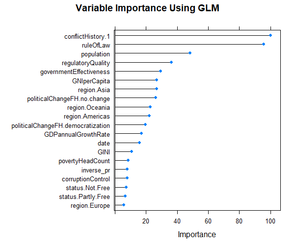

```{r setup, include=FALSE}
knitr::opts_chunk$set(
	echo = TRUE,
	message = FALSE,
	warning = FALSE
)
```

```{r loading the packages and the data, message=FALSE, warning=FALSE, include=FALSE, paged.print=FALSE}
library(readr)
library(lubridate)
library(dplyr)
library(Hmisc)
library(caret)
library(kernlab)
library(stringr)
library(knitr)
library(VIM)
library(ggplot2)

# reading the dataset to r
stabilityFullDataset <- read.csv("WGI2popDevIneqPovRegimeConflict2.csv", header = TRUE)
stabilityFullDataset <- as.data.frame(stabilityFullDataset)

```


In this section, we will apply some simple statistical procedures on Kaufman's data on political stability estimate to assess the stability of the whole world and its trend from 1996 to 2017. We will also compare the stability of the different regions and identify some of the most unstable counties in the world. Next, we will use predictive analytics or machine learning on our compiled dataset that include different variables (political, economic, social, and others) to identify the predictors (or determinants or conditions) of political stability 

## 2.1 - Descriptive Statistics

**Political Stability of the World Since the End of the Cold War**

Following Kaufman et al.'s methodology, the political stability estimate (or score) of a given country for a given year is based on the aggregation of the perceptions from several survey respondents, including what they call the "five representative sources": Economist Intelligence Unit Riskwire & Democracy Index (EIU), World Economic Forum Global Competitiveness Report (GCS), Cingranelli Richards Human Rights Database and Political Terror Scale (HUM), Institutional Profiles Database (IPD), Political Risk Services International Country Risk Guide (PRS), and Global Insight Business Conditions and Risk Indicators (WMO). [see @worldbankWorldwideGovernanceIndicators2016; and @kaufmannWorldwideGovernanceIndicators2011] In line with this, the annual political stability score assigned to a country ranges from -2.5 to 2.5, with some extreme values less than -2.5.^[When asked privately about these extreme values, one of Kaufman's associates stated that these were the results of the computations and could be either removed or taken as they were. We chose to keep these extreme values in this study] Using the dataset on the political stability estimate of all countries in the world for the period of 1996 to 2016, we can compute the stability of the world for the entire period and the annual stability trend from 1996 to 2016. Furthemore, we can compare the stability of the different regions in the world.

Refering to Figure 2.1 below, we can state that the whole world has been slightly stable since the end of the Cold War. Indeed, in computing the summary statistics of political stability during the time period of 1996-2017 around the world, we find that the average was 0.01739 (with standard deviation of 1.005123), the median 0.14080, the minimum -3.31494, and the maximum 1.96506.   

As shown in Figure 2.2, the data on political stability is not normally distributed, but skweed to the left, which indicates the existence of outliers with negative values.   


**Political Stability Trend and by Region** 

With regard to its trend, Table 2.1 and Figure 2.3 indicate that the political stability annual average of the world hovered around zero during the period of 1996 to 2017. It remained positive from 1996 to 2005, and then dipped for the most parts into negative values from 2006 to 2017.^[See Table 2.1 and Fig. 2.3]   


Table 2.2 and Figure 3.4 clearly show that the regions of Africa and Asia, with respectively an average of -0.575 and -0.388, were the two most unstable regions in the world during the time period of 1996-2016. On the contrary, the regions of Oceania and Europe, with respectively an average of 0.820 and 0.651, were the two most unstable regions in the world


**Identifying the Most Stable and Most Unstable Countries in the World**


```{r identification of the most stable and most unstable countries in the world, echo=FALSE, message=FALSE, warning=FALSE, paged.print=FALSE}

politicalStabilityByCountry <- summarise(group_by(stabilityFullDataset, country),
          mean=mean(stability, na.rm = TRUE), sd=sd(stability, na.rm = TRUE))

mostStable <- arrange(politicalStabilityByCountry, desc(mean))
kable(head(mostStable, 20), caption = "Table - The Most Stable Countries in the World")

mostUnstable <- arrange(politicalStabilityByCountry, mean)
kable(head(mostUnstable, 20), caption = "Table - The Most Unstable Countries in the World")


```


```{r most stable and unstable countries in Africa, echo=FALSE, message=FALSE, warning=FALSE, paged.print=FALSE}
# subsetting the African countries
stabilityFullDatasetAf <- filter(stabilityFullDataset, region == "Africa")

# calculating the average stability by country in Africa

politicalStabilityByCountryAf <- summarise(group_by(stabilityFullDatasetAf, country),
          mean=mean(stability, na.rm = TRUE), sd=sd(stability, na.rm = TRUE))

mostStableAf <- arrange(politicalStabilityByCountryAf, desc(mean))
kable(head(mostStableAf, 20, caption = "Table - The Most Stable Countries in the World"))

mostUnstableAf <- arrange(politicalStabilityByCountryAf, mean)
kable(head(mostUnstableAf, 20, caption = "Table - The Most Unstable Countries in the World"))

```


## 2. Machine Learning: Identifying the Predictors of Political Stability

In this machine learning implementation (or predictive analytics), we follow the guidelines suggested by different data scientists who specialize in the use *r* statistical and programming language and particularly the Caret package, created and maintained by Max Kuhn. Among these guidelines, we found particularly useful Saurav Kaushik's "Practical guide to implement machine learning with CARET in R" [-@kaushikPracticalGuideImplement2016] and Brett Lanz's *Machine Learning with R*. [-@lantzMachineLearning2015] After the initial step of installing the required packages (including the Caret package) and loading the dataset into r, this machine learning implementation includes the following:

- defining the problem,
- preprocessing the data,
- spliting the data into training and test sets,
- feature selection using the "recursive feature elimination"" or "rfe" function,
- traning models on the training set,
- generating variable importance,
- making predictions on the test set and assessing the accuracy of the models.


Since the complete *r* script used in this machine learning can be consulted in Appendix A, we will only focus on the following steps in this chapter: defining of the problem, feature selection using the "recursive feature elimination" (*rfe*) function, generating the variable importance, and making predictions to assess the accuracy of the selected model.

Defining the problem:

The problem in this machine learning implementation is to predict the stability score of a country. In other words, we are dealing here with a machine learning regression on the variable "stability."   

Feature (or variable) selection using the "recursive feature elimination" (*rfe*) function

Variables   RMSE Rsquared    MAE  RMSESD RsquaredSD   MAESD Selected
         4 0.4687   0.8032 0.3552 0.04209    0.02860 0.02965         
         8 0.2986   0.9151 0.2192 0.02050    0.01255 0.01355         
        16 0.2904   0.9196 0.2120 0.01743    0.01050 0.01192         
        24 0.2890   0.9203 0.2107 0.01715    0.00992 0.01166        *

The top 5 variables (out of 24):
   population, conflictHistory.1, ruleOfLaw, HDI, GNIperCapita


Generating the variable importance:

The variable importance procedure allows us to identify the following variables along with their respective importance

only 20 most important variables shown (out of 24)

                                  Overall
conflictHistory.1                 100.000
ruleOfLaw                          95.658
population                         48.325
regulatoryQuality                  36.260
governmentEffectiveness            29.361
GNIperCapita                       26.817
region.Asia                        26.704
politicalChangeFH.no.change        26.147
region.Oceania                     22.848
region.Americas                    22.204
politicalChangeFH.democratization  19.487
GDPannualGrowthRate                17.083
date                               15.842
GINI                               10.748
povertyHeadCount                    8.615
inverse_pr                          7.966
corruptionControl                   7.856
status.Not.Free                     7.216
status.Partly.Free                  6.638
region.Europe                       5.812

Assessing the accuracy of the selected model:

> stabilityModel_glm
Generalized Linear Model 

2838 samples
  24 predictor

No pre-processing
Resampling: Bootstrapped (25 reps) 
Summary of sample sizes: 2838, 2838, 2838, 2838, 2838, 2838, ... 
Resampling results:

  RMSE       Rsquared   MAE     
  0.5356276  0.7182354  0.413647

> 
> # Assessing the accuracy of the prediction
> 
> postResample(pred = stabilityPrediction_glm, obs = stabilityTestSet$stability)
     RMSE  Rsquared       MAE 
0.5344837 0.7042382 0.4188245 
> 


## Tables and Figures


```{r statistical summary of stability, fig.cap="Table 2.1 - Political Stability Around the World: Summary statistics", message=FALSE, warning=FALSE, include=FALSE, paged.print=FALSE}

# Table 2.1 - Political Stability Around the World: Summary statistics
summary(stabilityFullDataset$stability, na.rm = TRUE)

# Standard deviation
sd(stabilityFullDataset$stability, na.rm = TRUE)

```

```{r Table on summary statistics, echo=FALSE, message=FALSE, warning=FALSE, paged.print=FALSE}
Statistics <- c("Minimum", "Mean", "Standard Deviation", "Median", "Maximum")
Value <- c(-3.31494, 0.01739, 1.005123, 0.14080, 1.96506)
table2.1 <- cbind(Statistics, Value)
table2.1 <- tbl_df(table2.1)
table2.1 <- kable(table2.1, caption = "Table 2.1 - Political Stability of the World: Summary statistics")
table2.1

```


```{r figure 2.1 stability of the world, echo=FALSE, fig.cap="Figure 2.1 - Political Stability of the World: Summary Statistics", message=FALSE, warning=FALSE, paged.print=FALSE}

#Figure 2.1 - Political Stability of the World: Summary Statistics

boxplot(stabilityFullDataset$stability, ylab = "Political Stability Estimate")
abline(h = 0, lwd = 2, col = "red")

```


```{r figure 2.2, echo=FALSE, fig.cap="Figure 2 - Political Stability of the World: Frequency Distribution", message=FALSE, warning=FALSE, paged.print=FALSE}

#Figure 2.2 - Political Stability of the World: Frequency Distribution

hist(stabilityFullDataset$stability, main= "", xlab = "Political Stability Estimate")
abline(v = median(stabilityFullDataset$stability, na.rm = TRUE), col = "red", lwd = 2)
text(x = -1.5, y = 700, "Median= 0.14080")

```


```{r computing the stability trend of the world, message=FALSE, warning=FALSE, include=FALSE, paged.print=FALSE}

# Political Stability Trend: Annual Average Around the World
PoliticalStabilityTrendWorld <- stabilityFullDataset %>%
  group_by(date) %>%
  summarise(AnnualAverage = mean(stability, na.rm=TRUE))
PoliticalStabilityTrendWorld <- tbl_df(PoliticalStabilityTrendWorld)

```


```{r table 2.2 stability trend, message=FALSE, warning=FALSE, paged.print=FALSE}

#Table 2.2 - Political Stability Trend: Annual Average Around the World
names(PoliticalStabilityTrendWorld) <- c("Date", "Annual Average")
kable(PoliticalStabilityTrendWorld, caption = "Table 2.2 - Political Stability Trend of the World: Annual Average (1996-2017)")

```


```{r Fig. 2.3 Political stability of the world, echo=FALSE, fig.cap="Fig. 2.3 - Political stability Trend of the world: Annual Average (1996-2017)", fig.height=5, fig.width=6, message=FALSE, warning=FALSE, include=TRUE, paged.print=FALSE}


PoliticalStabilityTrendWorld$`Annual Average` <- as.numeric(PoliticalStabilityTrendWorld$`Annual Average`)

plot(PoliticalStabilityTrendWorld$Date, PoliticalStabilityTrendWorld$`Annual Average`, type="o", lwd = 2,
     ylim=range( -0.5:0.5),
     main="",
     xlab = "Years", ylab = "Political Stability Annual Average")
abline(h = 0, col = "red", lwd = 1.5)

```


```{r echo=FALSE, warning=FALSE, include=FALSE}

#Political Stability summary for each region

politicalStabilityByRegion <- summarise(group_by(stabilityFullDataset, region),
          mean=mean(stability, na.rm = TRUE), sd=sd(stability, na.rm = TRUE))

```


```{r echo=FALSE, warning=FALSE, include=TRUE, results= "asis"}

#Table 2.3 - Political Stability: Average by Region
names(politicalStabilityByRegion) <- c("Region", "Mean", "Standard Deviation")
kable(politicalStabilityByRegion, caption = "Table 2.3 - Political Stability: Average by Region")


```


```{r fig 2.4 average stability by region, echo=FALSE, fig.cap="Fig. 2.4 - Political Stability: Summary Statistics by Region", fig.height=5, fig.width=6.5, message=FALSE, warning=FALSE, paged.print=FALSE}

# Boxplot of Political Stability by Region
boxplot(stability~region,data=stabilityFullDataset, main="",
        xlab="Regions", ylab="Political Stability Estimate")
abline(h = 0, col = "red", lwd = 2)

```


```{r fig 2.4 boxplot of stability of the world, eval=FALSE, message=FALSE, warning=FALSE, include=FALSE, paged.print=FALSE}

ggplot(stabilityFullDataset, aes(y = stability)) +
  geom_boxplot() + 
  geom_hline(yintercept=0, color = "red", size=1.5) +
  ylab("Political Stability Estimate") + xlab("")

```


```{r fig boxplot of stability by region, eval=FALSE, message=FALSE, warning=FALSE, include=FALSE, paged.print=FALSE}
stabilityFullDataset1 <- na.omit(stabilityFullDataset)
ggplot(stabilityFullDataset1, aes(y = stability)) +
  geom_boxplot() + 
  geom_hline(yintercept=0, color = "red", size=1.5) +
  ylab("Political Stability Estimate") + xlab("") +
  facet_grid(.~ region)


```





## References


