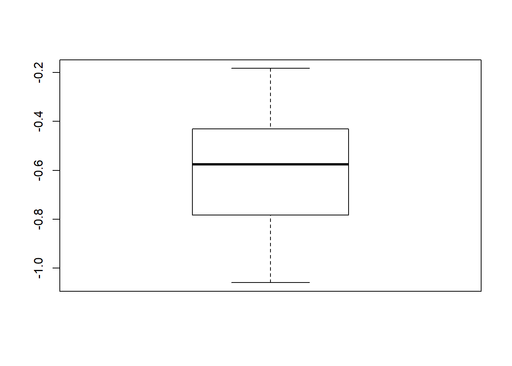
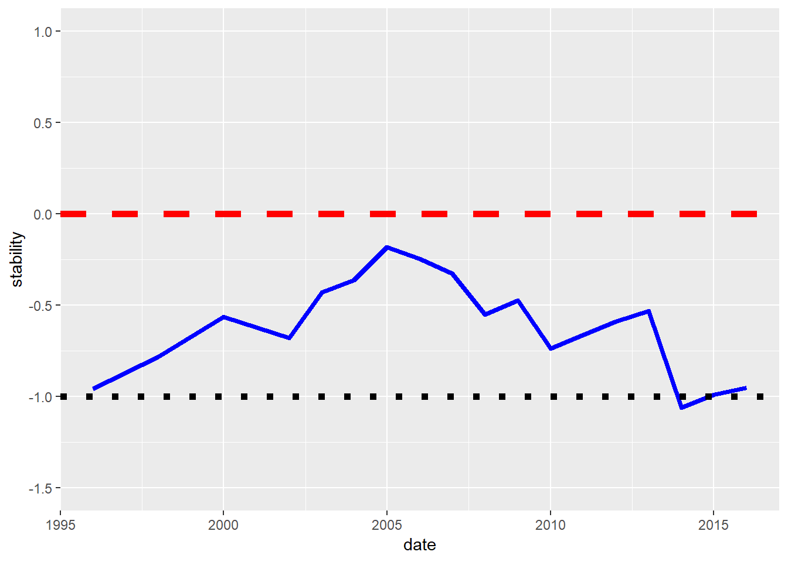
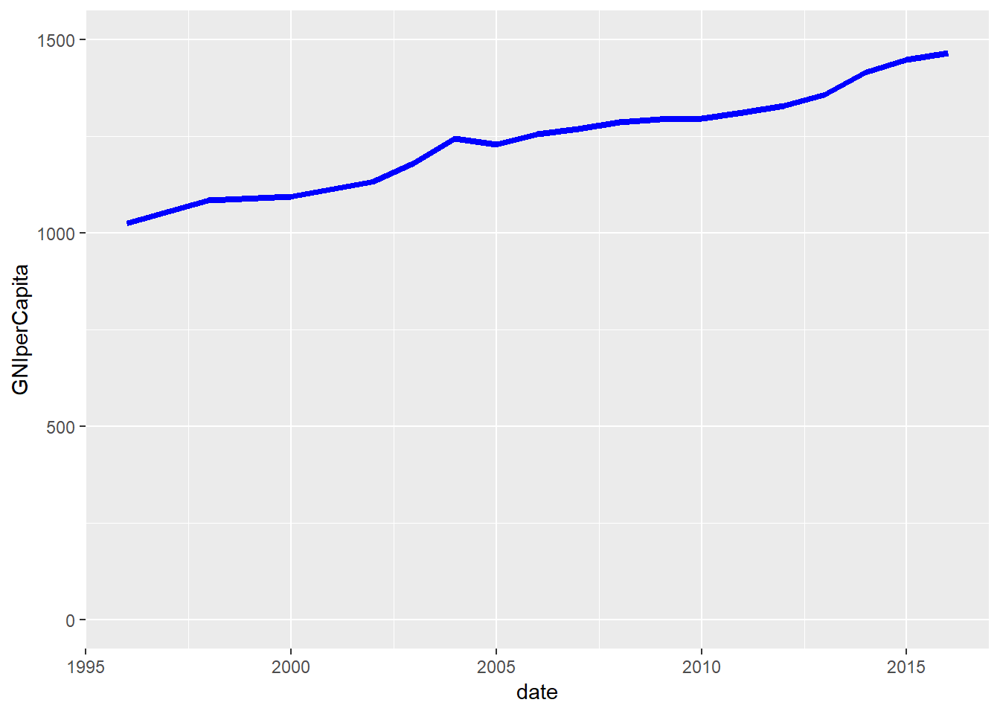
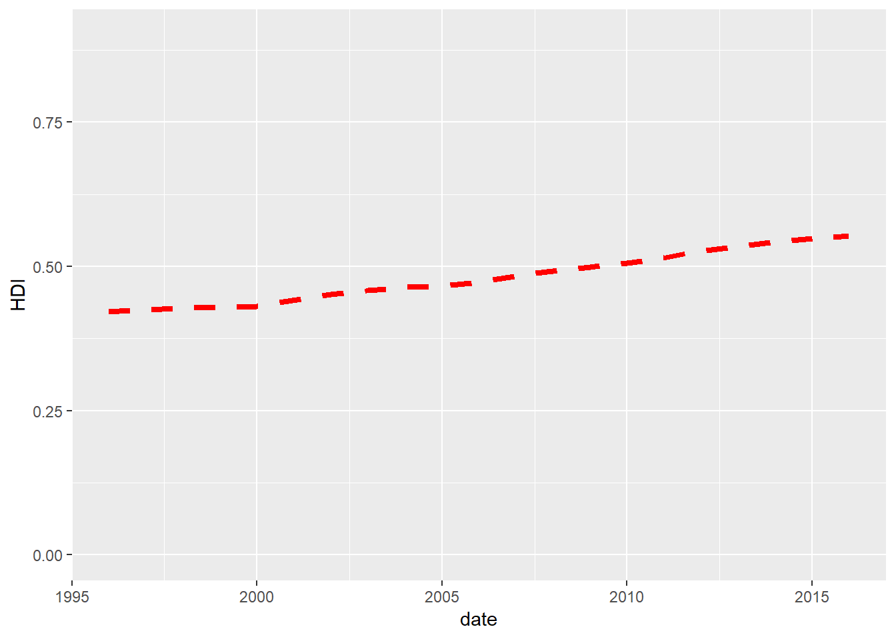
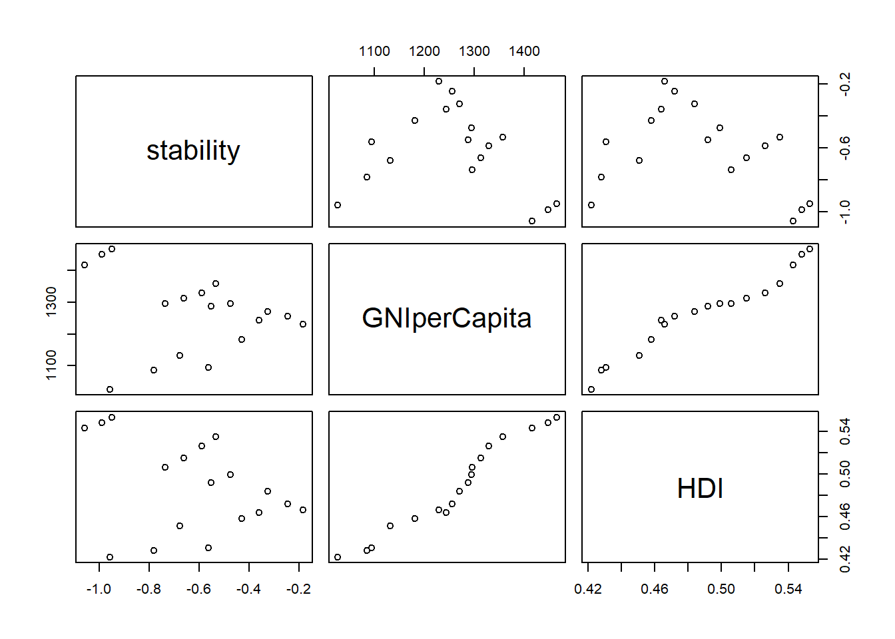
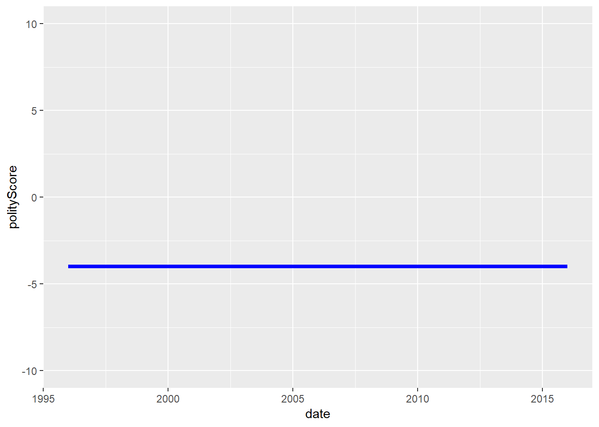
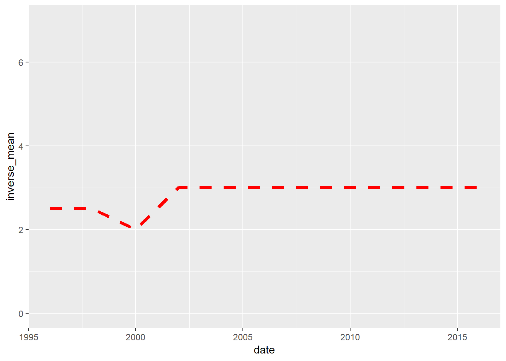
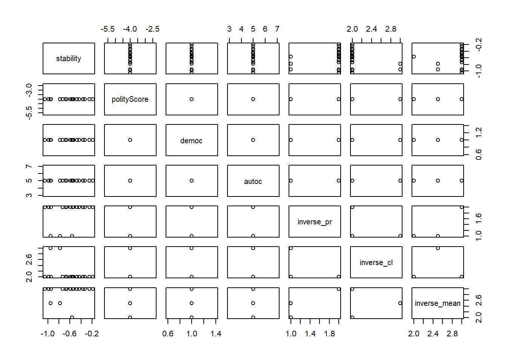

### Abstract


## Introduction


### Literature Review


### Research Questions

1) The regime has been unstable since the mid-1990s, but how did it manage to survive and prevent the escalation of conflict to crisis and civil war for so long?

2) The figure on stability trend shows two clear tendencies: first, a tendency toward stabilization between 1995 and 2005, second, a tendency toward destabilization since 2005, with a period of high instability and crisis (stability score lower than -1) in 2014-2015. So how can  we explain these two tendencies? What did the regime or the opposition do during the stabilization period? What did the regime or the opposition do during the destabilization period?

### Methodology

This research project combine both quantitative research and qualitative research methods.

The quantitative data are collected from available data online provided by different organization such as the World Bank, The United Nations Development Progammes (UNDP), the Center for Systemic Peace (Polity IV Project), Freedom House. The data are managed and analyzed in R with different packages.

The qualitative data consist of new reports and analysis provided by different organizations, new agencies and various analysts and scholars. The data are mostly available online.They are managed and analyzed coded using `RQDA` software,  following the "grounded theory" methodology.


## Political Stability Average and Trend for Cameroon


```r
# Summary statistics
summary(cameroon$stability)
```

```
##    Min. 1st Qu.  Median    Mean 3rd Qu.    Max. 
## -1.0593 -0.7710 -0.5757 -0.6148 -0.4410 -0.1831
```

```r
# Boxplot of the political stability
boxplot(cameroon$stability)
```




```r
# General trend of political stability since 1996

stabilityTrend <- ggplot(cameroon, aes(x= date, y = stability)) +
  geom_line(color = "blue", size = 1.5) +
  geom_hline(yintercept=0, linetype="dashed", color = "red", size=2) +
  geom_hline(yintercept=-1.0, linetype="dotted", color = "black", size=2) +
  xlim(1996, 2016) +
  ylim(-1.5, 1)

stabilityTrend
```



## Correlations between Political Stability and the Economic and Social Indicators


```r
# summary statistics of the GNI per capita

summary(cameroon$GNIperCapita)
```

```
##    Min. 1st Qu.  Median    Mean 3rd Qu.    Max. 
##    1026    1193    1279    1263    1325    1466
```


```r
# General trend of GNI per capita since 1996

ggplot(cameroon, aes(x= date, y = GNIperCapita)) +
  geom_line(color = "blue", size = 1.5) +
  ylim(0, 1500)
```




```r
# summary statistics of the HDI

summary(cameroon$HDI)
```

```
##    Min. 1st Qu.  Median    Mean 3rd Qu.    Max. 
##  0.4220  0.4595  0.4880  0.4885  0.5232  0.5530
```


```r
# General trend of HDI since 1996

ggplot(cameroon, aes(x= date, y = HDI)) +
  geom_line(color = "red", linetype="dashed", size = 1.5) +
  ylim(0.0, 0.9)
```




```r
# correlation test between stability and GNI per capita and HDI

cameroonEcoSoc <- cameroon %>%
  select(stability, GNIperCapita, HDI)

cor.test(cameroon$stability, cameroon$GNIperCapita)
```

```
## 
## 	Pearson's product-moment correlation
## 
## data:  cameroon$stability and cameroon$GNIperCapita
## t = -0.90605, df = 16, p-value = 0.3784
## alternative hypothesis: true correlation is not equal to 0
## 95 percent confidence interval:
##  -0.6234805  0.2742393
## sample estimates:
##        cor 
## -0.2209155
```

```r
cor.test(cameroon$stability, cameroon$HDI)
```

```
## 
## 	Pearson's product-moment correlation
## 
## data:  cameroon$stability and cameroon$HDI
## t = -1.3928, df = 16, p-value = 0.1827
## alternative hypothesis: true correlation is not equal to 0
## 95 percent confidence interval:
##  -0.6897995  0.1630787
## sample estimates:
##        cor 
## -0.3288271
```


```r
# plotting the correlation between stability and GNI per capita and HDI

cameroonEcoSoc <- cameroon %>%
  select(stability, GNIperCapita, HDI)


plot(cameroonEcoSoc)
```




## Correlations between Political Stability and the Regime Type Indicators


```r
# summary statistics of the polityScore

summary(cameroon$polityScore)
```

```
##    Min. 1st Qu.  Median    Mean 3rd Qu.    Max. 
##      -4      -4      -4      -4      -4      -4
```


```r
# General trend of polityScore since 1996

ggplot(cameroon, aes(x= date, y = polityScore)) +
  geom_line(color = "blue", size = 1.5) +
  ylim(-10, 10)
```




```r
# summary statistics of the Freedom House reversed combined score

summary(cameroon$inverse_mean)
```

```
##    Min. 1st Qu.  Median    Mean 3rd Qu.    Max. 
##   2.000   3.000   3.000   2.889   3.000   3.000
```


```r
# General trend of the Freedom House reversed combined score

ggplot(cameroon, aes(x= date, y = inverse_mean)) +
  geom_line(color = "red", linetype="dashed", size = 1.5) +
  ylim(0.0, 7)
```




```r
# correlation test between stability and polityScore and Freedom House's inversed combined scores of political rights and civil liberty

cor.test(cameroon$stability, cameroon$polityScore)
```

```
## 
## 	Pearson's product-moment correlation
## 
## data:  cameroon$stability and cameroon$polityScore
## t = NA, df = 16, p-value = NA
## alternative hypothesis: true correlation is not equal to 0
## 95 percent confidence interval:
##  NA NA
## sample estimates:
## cor 
##  NA
```

```r
cor.test(cameroon$stability, cameroon$inverse_mean)
```

```
## 
## 	Pearson's product-moment correlation
## 
## data:  cameroon$stability and cameroon$inverse_mean
## t = 0.67696, df = 16, p-value = 0.5081
## alternative hypothesis: true correlation is not equal to 0
## 95 percent confidence interval:
##  -0.3253498  0.5879337
## sample estimates:
##       cor 
## 0.1668667
```


```r
# Scatterplot of the correlations between stability and regime type indicators

cameroonRegimeType <- cameroon %>%
  select(stability, polityScore, democ, autoc, inverse_pr, inverse_cl, inverse_mean)

plot(cameroonRegimeType)
```




